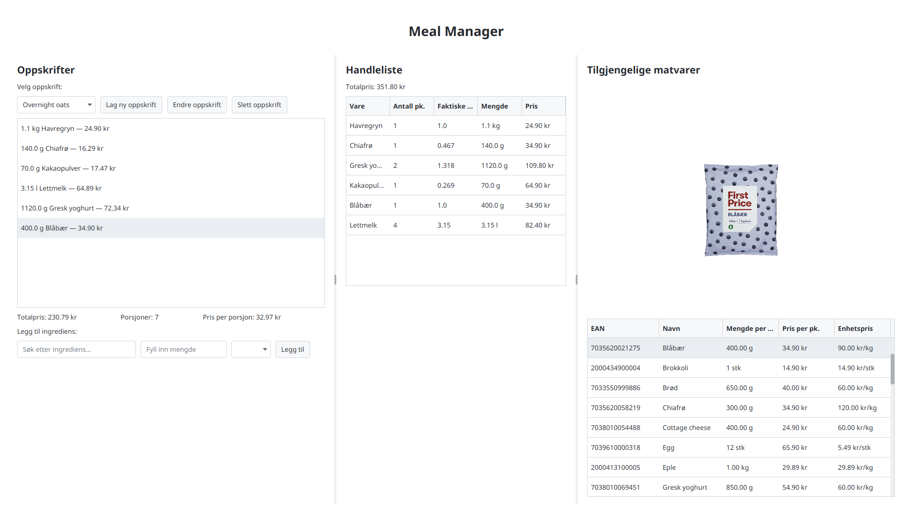

# Meal Manager

A JavaFX desktop app for planning meals. Build recipes from a catalog of grocery items, and automatically generate a priced shopping list containing every ingredient needed.



## Features

- **Recipes** — create recipes from a catalog of ~40 grocery items, each with
  a real price, package size, and measuring unit
- **Automatic pricing** — unit prices are derived from package price and
  size, so each recipe shows total cost and cost per serving
- **Shopping list generation** — aggregates every recipe's ingredients into a
  single shopping list, showing how many units/packages of each item you
  need to buy
- **Product images** — grocery items display product photos when browsing
  the catalog or adding ingredients to a recipe
- **Autosave** — recipes are persisted automatically and reloaded the next
  time the app starts
- **Input validation** — invalid amounts or missing selections are caught
  with clear feedback instead of crashing the app

## Tech stack

- Java 25
- JavaFX (UI) with [AtlantaFX](https://github.com/mkpaz/atlantafx) for styling
- Maven
- JUnit 5

## Getting started

### Prerequisites

- JDK 25+
- Maven

### Run

```bash
mvn javafx:run
```

### Test

```bash
mvn test
```

## Data

Grocery items are loaded from `data/groceryitems.csv`. Recipes are stored in
a simple custom text format at `data/recipes.txt` and are read/written
automatically as you use the app.

## Architecture

A class diagram is available in [`mealmanager.png`](mealmanager.png)
(source: [`mealmanager.puml`](mealmanager.puml)).

## License

[MIT](LICENSE)
